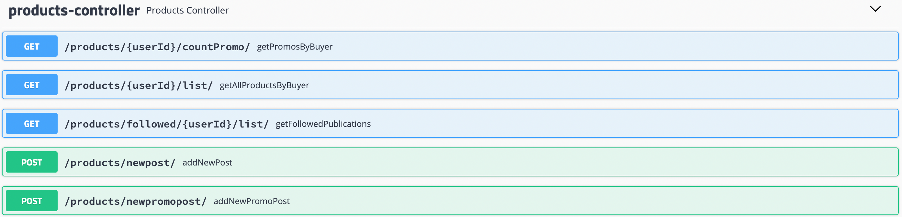
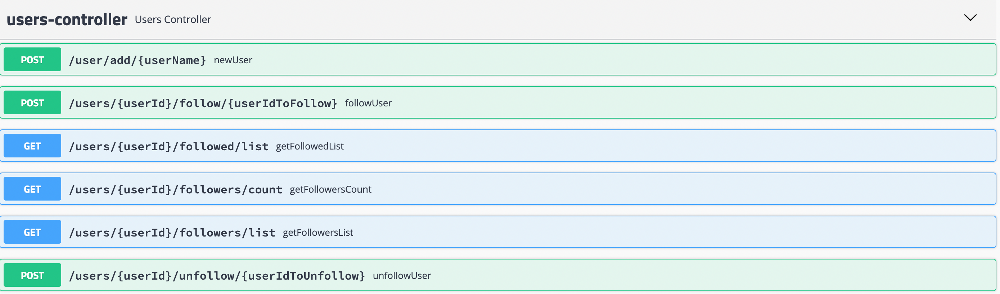

### **Programación Java**

` `Bootcamp Backend Java Desafío Spring
// Práctica Individual
___
#### Es importante tener en consideración:
Posterior a acceder al proyecto podra visualizar todos los endpoint y modelos existentes

Se agrego como nueva funcionalidad el poder crear usuarios nuevos mediante el endpoint:
`/user/add/{userName}`
Donde userName sera el nombre del nuevo usuario.

Todas las pruebas se pueden hacer mediante el navegador.

El listado de endpoint se muestra a continuación

Endpoint de Productos

Endpoint de Usuarios

___

Objetivo

El objetivo de este desafío es aplicar los contenidos dados hasta el momento durante el BOOTCAMP MeLi (Git, Java y Spring), con la finalidad de poder implementar una API REST a partir de un enunciado propuesto, una especificación de requisitos y documentación anexada.

Pautas para la actividad

El desafío que se propone a continuación consta de 2 partes:

1. **Desarrollar una API para un escenario determinado**. En el punto A de la siguiente sección se encuentra una descripción detallada del escenario y cada uno de los requerimientos solicitados.
1. **Bonus.** En el caso de que se completen todos los requerimientos establecidos en el punto A y aún se disponga de tiempo, se podrá realizar esta actividad que presenta un mayor nivel de complejidad.

Respecto a la dinámica de trabajo

**Te pedimos que en primer lugar respondas un [Quiz inicial](https://forms.gle/gFzR2yMZoXrUw1o76).** Para poder realizarlo es fundamental leer las consignas de cada requerimiento, ya que se solicita una estimación de tiempos de desarrollo aproximados para cada uno de los requerimientos.

En cada jornada se organizarán duplas de trabajo con la finalidad de que, en algún momento del día, se lleve a cabo un feedback al colega sobre el proyecto que se está realizando. El objetivo es intercambiar consultas, aportes y valorar el trabajo realizado por el compañero de trabajo. A su vez, contarán con un [**formulario**](https://forms.gle/A8W1xoEiS4grp9597), a modo de rúbrica, para consignar el feedback de cada día.

Durante el desafío los profesores estarán presentes a través de Zoom o Slack para cualquier consulta. Recordá indicar en la [**planilla** ](https://docs.google.com/spreadsheets/d/1C4QlBDwQ74VLAkUSWS6g8h_52DqS246XlS1PtEX_WAw/edit?usp=sharing)en qué situación te encontrás o si necesitás ayuda. No te olvides de completar el status de finalización al final de cada día. Es importante no modificar los valores de entrada.

Tené en cuenta que:

- La fecha de entrega y cierre es: **Jueves 10 de Junio, 18:00 hs** y debe realizarse mediante GitHUB.
- Todo el desafío debe ser desarrollado en **un solo proyecto.** 
- Para entregar la actividad, se deberá subir el proyecto finalizado al repositorio en la carpeta **“desafio\_spring”** ya existente dentro del branch personal identificado con el apellido y nombre. 
- Es **fundamental** que el proyecto sea subido **COMPLETO**, es decir, con todos los archivos necesarios para poder ejecutarlo.  

1. Escenario

Mercado Libre sigue creciendo y para el año que viene  tiene como objetivo empezar a implementar una serie de herramientas que permitan a los compradores y vendedores tener una experiencia totalmente innovadora, en donde el lazo que los una sea mucho más cercano. 

La fecha de lanzamiento se aproxima, por lo cual es necesaria la presentación de una versión Beta de lo que va a ser conocido como **“SocialMeli”**, en donde los compradores van a poder seguir a sus vendedores favoritos y enterarse de todas las novedades que los mismos posteen.

**Para ello, se plantea el requerimiento de la creación de una API Rest que permita:**

1. Poder realizar la acción de “Follow” (seguir) a un determinado vendedor
1. Obtener el resultado de la cantidad de usuarios que siguen a un determinado vendedor
1. Obtener un listado de todos los usuarios que siguen a un determinado vendedor (¿Quién me sigue?)
1. Obtener un listado de todos los vendedores a los cuales sigue un determinado usuario (¿A quién sigo?)
1. Dar de alta una nueva publicación.
1. Obtener un listado de las publicaciones realizadas por los vendedores que un usuario sigue en las últimas dos semanas (para esto tener en cuenta ordenamiento por fecha, publicaciones más recientes primero).
1. Poder realizar la acción de “Unfollow” (dejar de seguir) a un determinado vendedor.

Por otra parte, dado que se pretende una buena experiencia de usuario con respecto a la forma de presentación de los resultados de cada consulta, se necesita que los mismos puedan ser ordenados mediante cualquiera de los siguientes criterios: 

1. Alfabético Ascendente y Descendente
1. Fecha Ascendente y Descendente

Un analista funcional llevó a cabo el **relevamiento de los requerimientos técnicos funcionales** y ha proporcionado la documentación que se cita a continuación para tener en cuenta a la hora de llevar a cabo el desarrollo correspondiente:

<https://drive.google.com/file/d/1iPdb8VVgxi4SZtWNqwHo_lo-quODgi3i/view?usp=sharing>  

1. Bonus

**SocialMeli** además permitirá a los vendedores poder publicar nuevos productos con ofertas o descuentos especiales exclusivos para sus seguidores por un determinado período de tiempo. Para ello propone los siguientes requerimientos:

**10.** Llevar a cabo la publicación de un nuevo producto en promoción.

**11.** Obtener la cantidad de productos en promoción de un determinado vendedor

1**2.** Obtener un listado de todos los productos en promoción de un determinado vendedor

Tener en cuenta para estos requerimientos la posibilidad de poder ordenarlos alfabéticamente por nombre de cada producto tanto de forma ascendente como descendente.

Para finalizar, desde Mercado Libre dieron a conocer que están abiertos a cualquier nueva funcionalidad o propuesta de mejora para “**SocialMeli**”. En caso de que esto se lleve a cabo será necesario, además de desarrollar la funcionalidad, presentar la documentación técnica asociada.

